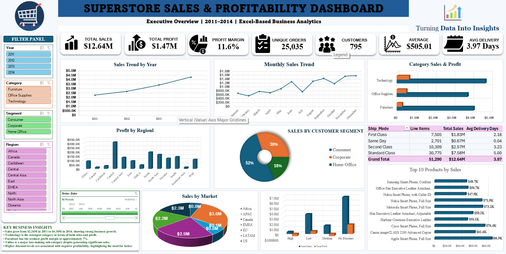
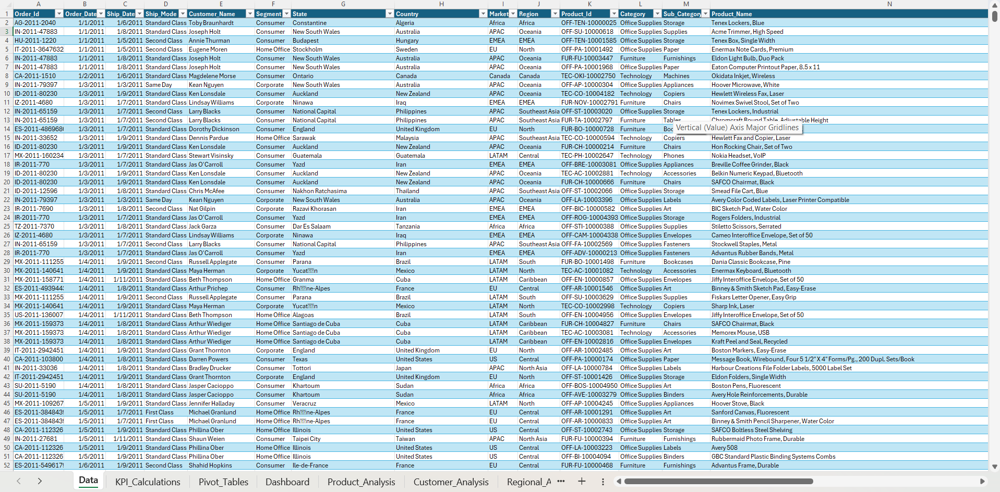
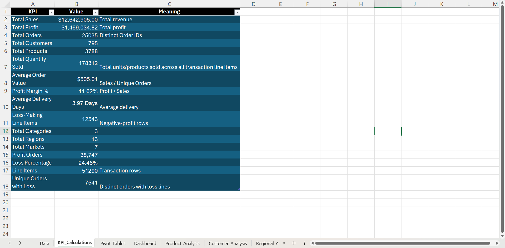
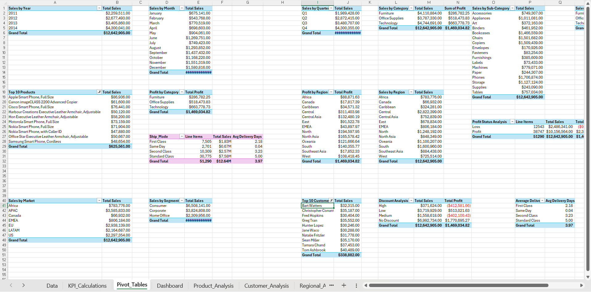
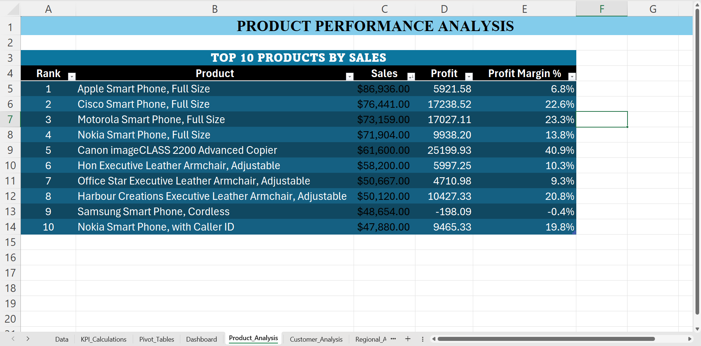
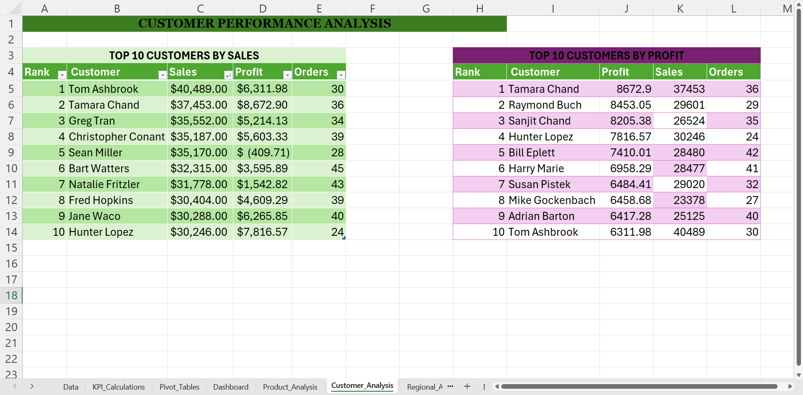
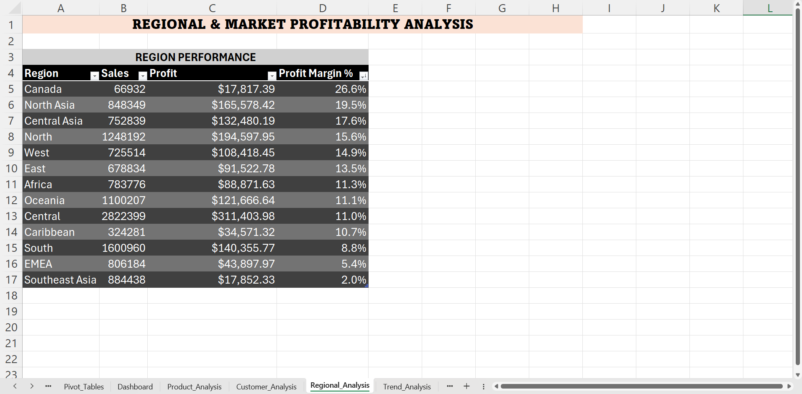
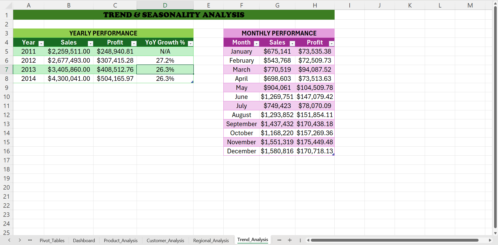
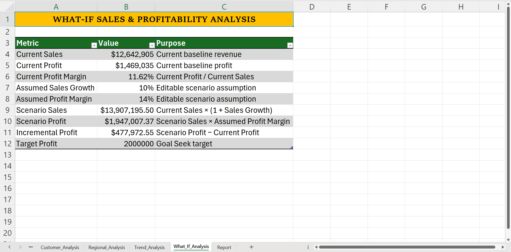
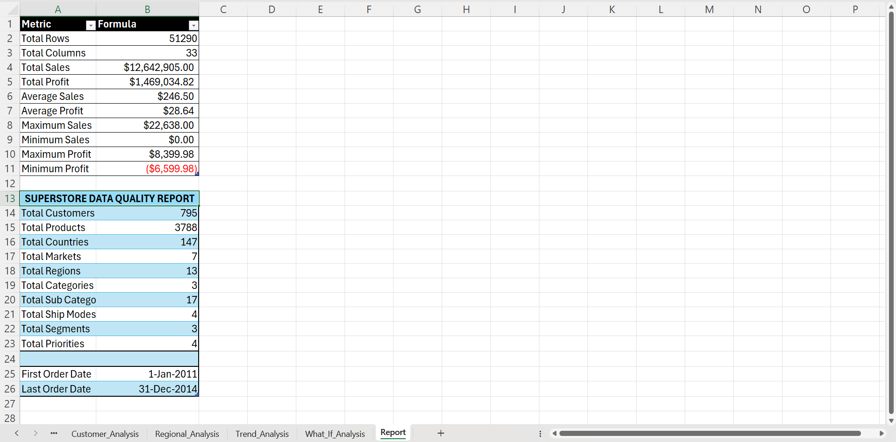

# Superstore Sales & Profitability Analytics Dashboard — Excel

## 📊 Project Overview

An **Excel-only Business Analytics project** built using Superstore transactional sales data covering **2011–2014**.

The project transforms raw transactional data into a structured Excel analytics workbook and an interactive dashboard to evaluate **sales performance, profitability, customer performance, product performance, regional trends, market performance, discount impact, shipping performance, and seasonal trends**.

The complete project was developed using **Microsoft Excel only**, with no SQL, Python, Power BI, or other external analytics tools.

---

## 🎯 Business Objective

The objective of this project is to analyze Superstore sales data and convert transactional information into actionable business insights.

The analysis focuses on:

- Sales and profit trends
- Product performance
- Customer performance
- Category and sub-category performance
- Regional and market profitability
- Discount impact on profitability
- Shipping and delivery performance
- Seasonal sales patterns
- Business growth opportunities
- Profitability risks and loss-making areas

---

## 📁 Dataset Overview

| Metric | Value |
|---|---:|
| Transaction Line Items | 51,290 |
| Unique Orders | 25,035 |
| Customers | 795 |
| Product Names | 3,788 |
| Product IDs / SKUs | 10,292 |
| Countries | 147 |
| Markets | 7 |
| Regions | 13 |
| Categories | 3 |
| Sub-Categories | 17 |
| Ship Modes | 4 |
| Customer Segments | 3 |
| Order Priorities | 4 |
| Analysis Period | 2011–2014 |
| Total Sales | $12.64M |
| Total Profit | $1.47M |
| Overall Profit Margin | 11.6% |

---

## 🛠️ Tools & Excel Techniques

### Tool

- Microsoft Excel

### Excel Techniques Used

- Excel Tables
- Structured References
- SUMIFS
- COUNTIFS
- IF
- IFERROR
- UNIQUE
- FILTER
- PivotTables
- PivotCharts
- Slicers
- Timeline
- Conditional Formatting
- Data Validation
- KPI Analysis
- Trend Analysis
- Profitability Analysis
- Product Analysis
- Customer Analysis
- Regional Analysis
- What-If Analysis
- Goal Seek
- Interactive Dashboard

---

## 📌 Key Analysis Areas

### 📈 Sales Analysis

- Yearly sales performance
- Monthly sales trends
- Quarterly sales performance
- Sales by category
- Sales by market
- Sales by customer segment

### 💰 Profitability Analysis

- Total profit
- Profit margin
- Profit by category
- Profit by region
- Loss-making line items
- Loss-making products
- Discount vs. profitability analysis

### 📦 Product Analysis

- Top 10 products by sales
- Product-level profit analysis
- Profit margin by product
- Top-performing products
- Loss-making products

### 👥 Customer Analysis

- Top 10 customers by sales
- Top 10 customers by profit
- Customer order activity
- Customer value comparison

### 🌍 Regional & Market Analysis

- Regional sales
- Regional profit
- Regional profit margin
- Market-level performance
- Geographic profitability comparison

### 🚚 Operational Analysis

- Shipping mode performance
- Delivery days
- Order priority
- Shipping performance

### 🔮 Scenario Analysis

- Sales growth scenarios
- Profit margin scenarios
- Scenario sales
- Scenario profit
- Incremental profit
- Goal Seek for target profit

---

# 📊 Interactive Excel Dashboard

The final dashboard provides a management-focused view of the business through:

- KPI cards
- Year slicer
- Category slicer
- Segment slicer
- Region slicer
- Order Date timeline
- Sales trend by year
- Monthly sales trend
- Category sales and profit comparison
- Profit by region
- Customer segment analysis
- Market analysis
- Discount profitability analysis
- Top 10 products by sales
- Key business insights

The dashboard allows users to interactively filter the analysis using Excel **Slicers and Timeline** and quickly evaluate changes in sales and profitability across different business dimensions.

---

# 🔍 Key Business Insights

- **Sales increased from approximately $2.26M in 2011 to $4.30M in 2014**, indicating strong business growth during the analysis period.

- **Technology is the strongest major category in terms of both sales and profit**, making it an important contributor to overall business performance.

- **Furniture has the weakest profit margin at approximately 7%**, despite generating more than $4.1M in sales.

- **Tables is a major loss-making sub-category**, despite generating significant revenue, making it an important area for further investigation.

- **Higher discount levels are associated with weaker or negative profitability**, highlighting discount management as an important profitability lever.

- **Q4 is the strongest sales quarter**, indicating clear seasonal demand patterns that can support planning and promotional decisions.

---

# 💡 Business Recommendations

- Review high-discount transactions where profitability becomes negative.
- Investigate loss-making products and the Tables sub-category.
- Evaluate pricing, discounting, shipping costs, and product mix for weak-margin products.
- Prioritize high-margin products and profitable customer segments.
- Monitor regional profitability separately from revenue performance.
- Use seasonal demand patterns to improve inventory and promotional planning.

---

# 📷 Dashboard Preview



---

# 📚 Workbook Preview

The workbook contains multiple analytical worksheets covering the complete Excel-based analysis process.

## 1. Executive Dashboard

The main dashboard provides an interactive management view of sales, profitability, customer performance, regional performance, discount impact, product performance, and business trends.


---

## 2. Data Preparation

The **Data** worksheet contains the transactional dataset and calculated analytical fields used throughout the project.



---

## 3. KPI Calculations

The **KPI_Calculations** worksheet contains the project's core business metrics, including total sales, total profit, profit margin, unique orders, customers, average order value, delivery performance, and loss-making line items.



---

## 4. Pivot Table Analysis

The **Pivot_Tables** worksheet contains summarized business analysis across year, month, quarter, category, sub-category, region, market, segment, shipping mode, customers, products, and discount bands.



---

## 5. Product Analysis

The **Product_Analysis** worksheet evaluates product performance using sales, profit, and profit margin, including top-performing and loss-making products.



---

## 6. Customer Analysis

The **Customer_Analysis** worksheet compares customers by sales, profit, and order activity to identify high-value customers and differences in customer profitability.



---

## 7. Regional Analysis

The **Regional_Analysis** worksheet compares regional sales, profit, and profit margins to identify geographical performance differences.



---

## 8. Trend & Seasonality Analysis

The **Trend_Analysis** worksheet evaluates yearly growth, monthly sales patterns, and seasonal performance across the 2011–2014 period.



---

## 9. What-If Analysis

The **What_If_Analysis** worksheet evaluates how different sales growth and profit margin assumptions affect scenario sales, scenario profit, and incremental profit.

The worksheet also demonstrates **Excel Goal Seek** for target-profit analysis.



---

## 10. Project Report

The **Report** worksheet summarizes the dataset, major findings, business insights, and recommendations derived from the analysis.



---

# 📂 Project Files

### Excel Workbook

[Download the Complete Excel Workbook](./SuperStoreOrders%20-%20SuperStoreOrders.xlsx)

### CSV Dataset

[View / Download the CSV Dataset](./SuperStoreOrders%20-%20SuperStoreOrders.csv)

### Project Documentation

[View README](./README.md)

---

# 📁 Repository Structure

```text
Superstore_Sales_Profitability_Excel_Dashboard/
│
├── README.md
│
├── SuperStoreOrders - SuperStoreOrders.csv
├── SuperStoreOrders - SuperStoreOrders.xlsx
│
├── dashboard.png.png
├── data.png.png
├── data2.png.png
├── kpi-calculations.png.png
├── pivot-tables.png.png
├── product-analysis.png.png
├── customer-analysis.png.png
├── regional-analysis.png.png
├── trend-analysis.png.png
├── what-if-analysis.png.png
└── report.png.png
